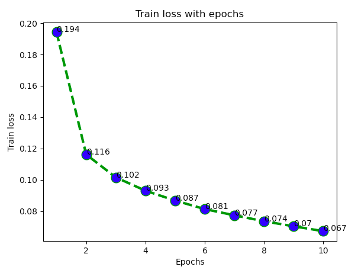
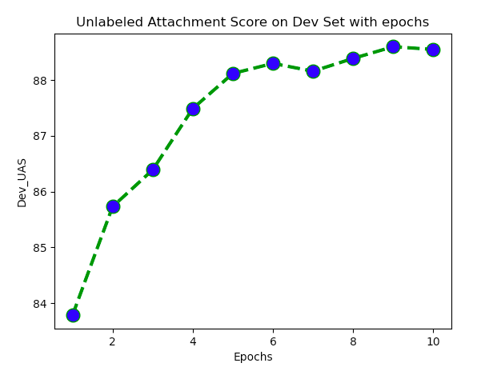

# Neural Transition-Based Dependency Parsing

## Create environment
```
conda env create -f local_env.yml

conda activate cs224n_a3
```

## Module test
```
python parser_model.py -e   # sanity check for embedding_lookup()

python parser_model.py -f   # sanity check for forward()
```

## Run on small sample
```
python run.py -d
```

## Run on full dataset
```
python run.py
```

## Results

Train loss after 10 epochs            : 0.067

Unlabeled Attachment Score on Test Set: 89.01

## Plots




## Refer to [handout](handout3.pdf) for more detailed instructions